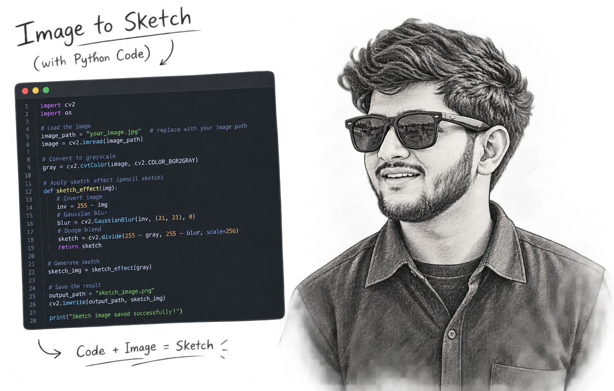

<h1 align="center">Hi 👋, I'm Saif Ahmad</h1>

<h3 align="center">
AI Engineer · Generative AI · LLMs · RAG · AI Agents · Full-Stack Systems
</h3>

<p align="center">
  Building production-oriented AI systems that combine intelligent models,
  scalable software architecture, and thoughtful product experiences.
</p>

<p align="center">
  <a href="https://saifahmad07.vercel.app/" target="_blank">AI / Developer Portfolio</a>
  &nbsp;•&nbsp;
  <a href="https://saifahmadin.vercel.app/" target="_blank">Product Design Portfolio</a>
  &nbsp;•&nbsp;
  <a href="https://www.linkedin.com/in/saif-ahmad-007" target="_blank">LinkedIn</a>
  &nbsp;•&nbsp;
  <a href="mailto:saif@saifahmad07.vercel.app">Email</a>
</p>

<p align="center">
  
</p>

<p align="center">
  <a href="https://github.com/saif007s">
    
  </a>
  <a href="https://github.com/saif007s?tab=followers">
    
  </a>
</p>

---

## 👨‍💻 About Me

I'm **Saif Ahmad**, an **AI Engineer** focused on designing and building intelligent software systems powered by **Generative AI, LLMs, RAG, AI Agents, and modern full-stack technologies**.

I enjoy working across the complete AI product lifecycle:

**Problem → Data → Architecture → AI System → Product → Evaluation → Deployment → Iteration**

My engineering approach combines **AI/ML, backend engineering, cloud infrastructure, and product design** to turn complex ideas into reliable and usable software.

### What I Build

* 🤖 Production-oriented **Generative AI & LLM applications**
* 🔎 **RAG and enterprise knowledge systems**
* 🧩 **AI Agents & multi-agent workflows**
* 🛠️ **AI developer tools and coding assistants**
* 🧠 **Machine Learning & Deep Learning systems**
* 💻 **Full-Stack AI applications and SaaS products**
* ☁️ **Cloud-native and containerized AI services**
* 📊 **AI evaluation, monitoring, and inference pipelines**

> **Build intelligent systems. Engineer reliable software. Design meaningful experiences.**

---

# 🧠 Core Expertise

| Domain                      | Expertise                                                                       |
| --------------------------- | ------------------------------------------------------------------------------- |
| 🤖 **AI Engineering**       | Generative AI · LLMs · AI Agents · Agentic Systems · AI Architecture            |
| 🔎 **RAG & Search**         | Advanced RAG · Embeddings · Vector Search · Hybrid Retrieval · Reranking        |
| 🧠 **Machine Learning**     | ML · Deep Learning · NLP · Transformers · Computer Vision                       |
| 🧩 **Agent Engineering**    | Tool Calling · Function Calling · MCP · Planning · Memory · Multi-Agent Systems |
| 💻 **Software Engineering** | Python · TypeScript · APIs · System Design · Distributed Systems                |
| ⚙️ **Backend**              | FastAPI · Flask · Node.js · REST APIs · Async Systems · Microservices           |
| 🌐 **Frontend**             | React · Next.js · TypeScript · Tailwind CSS                                     |
| 🗄️ **Data**                | PostgreSQL · MySQL · MongoDB · Redis · Vector Databases                         |
| ☁️ **Cloud & DevOps**       | Docker · CI/CD · GitHub Actions · Cloud Deployment · Kubernetes                 |
| 📈 **MLOps**                | Model Serving · Evaluation · Monitoring · Inference · Experimentation           |
| 🎨 **Product Design**       | UX Research · UI Design · Interaction Design · Design Systems                   |

---

# 🛠️ Technology Stack

### Languages

<p>
  
</p>

**Python · TypeScript · JavaScript · Java · C · SQL · Bash**

### AI / Machine Learning

<p>
  
</p>

**PyTorch · TensorFlow · Transformers · Generative AI · LLMs · NLP · Deep Learning · Computer Vision**

### LLM & AI Engineering

**LangChain · LlamaIndex · LangGraph · CrewAI · RAG · Embeddings · Vector Search · Tool Calling · Function Calling · MCP · AI Evaluation · Prompt Engineering · Model Integration**

### Backend & APIs

**FastAPI · Flask · Node.js · Express.js · REST APIs · WebSockets · Async Programming · API Architecture**

### Frontend

<p>
  
</p>

**React · Next.js · TypeScript · Tailwind CSS · Responsive Interfaces · Component Architecture**

### Databases & Data

<p>
  
</p>

**PostgreSQL · MySQL · MongoDB · Redis · ChromaDB · FAISS · pgvector · Vector Databases · Data Pipelines**

### Cloud & Infrastructure

<p>
  
</p>

**AWS · Google Cloud · Azure · Docker · Kubernetes · Linux · GitHub Actions · CI/CD · Cloud Deployment**

### Engineering

**Git · GitHub · Testing · Debugging · Code Review · System Design · Software Architecture · Distributed Systems · Performance Optimization · Documentation**

### Product & Design

**Figma · FigJam · Framer · ProtoPie · Adobe Creative Cloud · UX Research · Interaction Design · Design Systems · Prototyping**

---

# 🔬 AI Engineering Focus

### Generative AI & LLM Applications

* LLM application architecture
* Prompt and context engineering
* Structured outputs
* Function and tool calling
* Model integration
* Multimodal AI
* AI workflow automation
* LLM evaluation
* Inference optimization

### Retrieval-Augmented Generation

* Document ingestion
* Data preprocessing
* Chunking strategies
* Embedding pipelines
* Vector databases
* Semantic retrieval
* Hybrid search
* Metadata filtering
* Reranking
* Context optimization
* Grounded generation
* Retrieval evaluation

### Agentic AI

* Agent architecture
* Tool use
* Planning
* Memory
* Workflow orchestration
* Multi-agent systems
* MCP
* API integration
* Autonomous task execution

---

# 🏗️ How I Engineer AI Systems

```text
                    ┌─────────────────┐
                    │     Problem     │
                    └────────┬────────┘
                             ↓
                    ┌─────────────────┐
                    │ Data & Knowledge│
                    └────────┬────────┘
                             ↓
                    ┌─────────────────┐
                    │ AI Architecture │
                    └────────┬────────┘
                             ↓
             ┌───────────────┴───────────────┐
             ↓                               ↓
      ┌─────────────┐                 ┌─────────────┐
      │ RAG / Search│                 │ AI Agents   │
      └──────┬──────┘                 └──────┬──────┘
             └───────────────┬───────────────┘
                             ↓
                    ┌─────────────────┐
                    │ Backend / APIs  │
                    └────────┬────────┘
                             ↓
                    ┌─────────────────┐
                    │ Product / UI    │
                    └────────┬────────┘
                             ↓
                    ┌─────────────────┐
                    │ Test & Evaluate │
                    └────────┬────────┘
                             ↓
                    ┌─────────────────┐
                    │ Deploy & Monitor│
                    └─────────────────┘
```

I focus on building systems that are:

**Reliable · Evaluated · Observable · Scalable · Secure · Maintainable**

---

# 🚀 Selected Projects

### 🧠 NEXUS AI — Enterprise AI Platform

A production-oriented AI platform combining **LLM applications, RAG, intelligent agents, model routing, and scalable backend infrastructure**.

**Architecture**

`AI Agents` `RAG` `Model Gateway` `Vector DB` `PostgreSQL` `Redis` `Kafka` `FastAPI` `Next.js` `Docker` `Kubernetes`

**Engineering Focus**

`Agent Orchestration` `Retrieval` `Inference` `Evaluation` `Distributed Systems` `Observability`

---

### 🔍 AI Code Reviewer

An AI-powered developer tool designed to analyze code, identify potential issues, explain problems, and provide actionable engineering recommendations.

**Capabilities**

`Code Understanding` `LLMs` `RAG` `Static Analysis` `Security Review` `Architecture Review` `Tool Calling`

**Stack**

`Python` `FastAPI` `TypeScript` `Next.js` `LLMs` `Vector Search`

---

### 📚 RAG AI Agent

A document-grounded AI agent capable of ingesting knowledge, retrieving relevant context, reasoning over information, and generating grounded responses.

**Pipeline**

`Documents → Processing → Chunking → Embeddings → Retrieval → Reranking → LLM → Grounded Response`

**Stack**

`Python` `LangChain` `LLMs` `Embeddings` `Vector Database`

---

### 🏗️ BuildMind AI

An AI-powered application builder designed to transform natural-language requirements into functional full-stack applications.

**Focus**

`Generative AI` `Code Generation` `AI Agents` `Full-Stack Generation` `Sandboxed Execution`

**Stack**

`Next.js` `React` `TypeScript` `Prisma` `PostgreSQL` `AI APIs`

---

### 🎨 ArtFusion AI

A generative AI SaaS platform for creating AI-powered visual content through a modern full-stack application.

**Focus**

`Generative AI` `Image Generation` `SaaS Architecture` `Async Processing`

**Stack**

`Next.js` `React` `PostgreSQL` `Drizzle` `AI APIs`

---

# 🎨 Product Design

Alongside engineering, I have a strong interest in **UI/UX and Product Design**, particularly for AI-powered products.

### Product Design Focus

**UX Research · Information Architecture · User Flows · Wireframing · Prototyping · Interaction Design · Design Systems · Accessibility · Developer Handoff**

### Design Tools

**Figma · FigJam · Framer · ProtoPie · Adobe Creative Cloud**

My design background helps me think beyond models and APIs and consider the complete product experience:

**User Problem → Product Strategy → UX → AI Interaction → Engineering → Outcome**

---

# 📈 Engineering Principles

I believe good AI engineering is more than connecting an LLM to an API.

### I care about:

* **Reliability** — predictable system behavior
* **Evaluation** — measuring AI quality instead of guessing
* **Scalability** — designing for growing workloads
* **Observability** — understanding system behavior in production
* **Security** — protecting data, models, APIs, and users
* **Performance** — optimizing latency and resource usage
* **Maintainability** — clean architecture and documentation
* **User Experience** — making complex AI simple to use

> **The goal isn't to build an impressive AI demo. The goal is to engineer an AI product that people can actually rely on.**

---

# 🔭 Currently Exploring

* Advanced RAG architectures
* Agentic AI systems
* Multi-agent orchestration
* Model Context Protocol (MCP)
* Multimodal AI
* AI evaluation and observability
* LLM inference optimization
* Distributed AI systems
* AI infrastructure
* Production MLOps

---

# 🤝 Open to Opportunities

I'm interested in:

**AI Engineering · Generative AI · LLM Applications · RAG · AI Agents · AI Developer Tools · Full-Stack AI · Machine Learning · MLOps · Open Source**

I'm always interested in collaborating on ambitious products, challenging engineering problems, and open-source projects.

📩 **Available for full-time AI Engineering opportunities and high-impact collaborations.**

---

# 🌐 Connect

<p align="center">
  <a href="https://saifahmad07.vercel.app/">Developer Portfolio</a>
  &nbsp;•&nbsp;
  <a href="https://saifahmadin.vercel.app/">Product Design Portfolio</a>
  &nbsp;•&nbsp;
  <a href="https://www.linkedin.com/in/saif-ahmad-007">LinkedIn</a>
  &nbsp;•&nbsp;
  <a href="https://github.com/saif007s">GitHub</a>
</p>

<p align="center">
  <strong>Building intelligent systems. Engineering scalable software. Designing better products.</strong>
</p>
